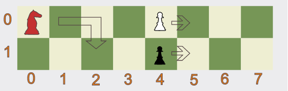

# codewars問題ピックアップ
[codewars](https://www.codewars.com/)の問題のピックアップ。各問題のタイトルからcodewarsのページへ飛べる。  
初日レベルでは配列を使わない問題を解いてもらう想定。解答例はできる限り自分で解いてから見ること。

ちなみに、[Get the Middle Character](#get-the-middle-character)は7kyuだが配列を使わないので、初日でも解けると思う。余裕があれば。

## 概要
問題を適当にピックアップし、簡単な日本語訳と解答例を記載した。  
ピックアップ基準は以下の通り。
- アルゴリズム能力を求められるもの
- javaの知識だけである程度解けるもの
  - あくまでも**ある程度**で、正規表現などは一部必要
- 参考になる別解がありそうなもの
  - javaの書き方やアルゴリズムの別解
- 解いてて楽しいもの
- 安川が解けたもの


## 目次
- [codewars問題ピックアップ](#codewars問題ピックアップ)
	- [概要](#概要)
	- [目次](#目次)
- [8kyu](#8kyu)
	- [Get Nth Even Number](#get-nth-even-number)
	- [Twice as old](#twice-as-old)
	- [If you can't sleep, just count sheep!!](#if-you-cant-sleep-just-count-sheep)
	- [Triple Trouble](#triple-trouble)
	- [Cat years, Dog years](#cat-years-dog-years)
	- [A wolf in sheep's clothing](#a-wolf-in-sheeps-clothing)
- [7kyu](#7kyu)
	- [Highest and Lowest](#highest-and-lowest)
	- [Get the Middle Character](#get-the-middle-character)
	- [List Filtering](#list-filtering)
	- [Reverse words](#reverse-words)
	- [Last Survivor](#last-survivor)
	- [Red Knight](#red-knight)
	- [Status Arrays](#status-arrays)


# 8kyu
## [Get Nth Even Number](https://www.codewars.com/kata/5933a1f8552bc2750a0000ed)
***配列を使わない問題***
N個目の偶数を返す。ただし、1つめの偶数は0とする。

**例**
```text 
N=1 --> 0
N=3 --> 4 (0,2,4)
N=5 --> 8 (0,2,4,6,8)
```

<details><summary>回答例</summary>

```java 
public static int nthEven(int n) {
	return n * 2 - 2;
}
```

</details><br/>

## [Twice as old](https://www.codewars.com/kata/5b853229cfde412a470000d0)
***配列を使わない問題***
現在の父親の年齢と息子の年齢が渡されるので、「父親が息子の2倍の年齢だったのは何年前か」または「何年後に2倍の年齢になるか」を計算する。

**例**
```text 
父親=30,息子=7 --> 16 (16年後、父親46・息子23となる)
父親=45,息子=30 --> 15 (15年前、父親30・息子15となる)
```

<details><summary>回答例</summary>

```java 
public static int TwiceAsOld(int dadYears, int sonYears) {
	return Math.abs(dadYears - sonYears * 2);
}
```

</details><br/>


## [If you can't sleep, just count sheep!!](https://www.codewars.com/kata/5b077ebdaf15be5c7f000077)
***配列を使わない問題***
渡された数値の回数だけ羊を数えた文字列を返す。ただし、0が渡されたときは羊を数えない。

**例**
```text 
3 --> "1 sheep...2 sheep...3 sheep..."
```

<details><summary>回答例</summary>

```java 
public static String countingSheep(int num) {
	String s = "";
	for (int i = 1; i < num + 1; i++) {
		s += i + " sheep...";
	}

	return s;
}
```

</details><br/>


## [Triple Trouble](https://www.codewars.com/kata/5704aea738428f4d30000914)
***配列を使わない問題***
3つ文字列を渡されるので、各文字列の先頭から順に合体させた文字列を返す。
前提として、入力される文字列はすべて同じ長さである。

**例**
```text 
"aa","bb","cc" --> "abcabc"
"Bm","aa","tn" --> "Batman"
"Cln","hlg","aee" --> "Challenge"
```

<details><summary>回答例</summary>

```java 
public static String tripleTrouble(String one, String two, String three) {
	StringBuilder trouble = new StringBuilder();	// StringBuilderはStringより色々できる文字列
	for (int i = 0; i < one.length(); i++) {
		trouble.append(one.charAt(i));
		trouble.append(two.charAt(i));
		trouble.append(three.charAt(i));
	}

	return trouble.toString();
}
```

</details><br/>


## [Cat years, Dog years](https://www.codewars.com/kata/5a6663e9fd56cb5ab800008b)
人間の年齢(humanYears)を渡されるので、人間の年齢、猫の年齢(catYears)、犬の年齢(dogYears)を計算して返す。
条件は以下の通り。
1. humanYears
   1. 必ず1以上である
   1. 必ず整数である
1. catYears
   1. 最初の年は+15年
   1. 2年目は+9年
   1. その後は毎年+4年
1. dogYears
   1. 最初の年は+15年
   1. 2年目は+9年
   1. その後は毎年+5年


**例**
```text 
 1 --> humanYears=1, catYears=15, dogYears=15
 2 --> humanYears=2, catYears=24, dogYears=24
10 --> humanYears=10, catYears=56, dogYears=64
```

<details><summary>回答例</summary>

```java 
public static int[] humanYearsCatYearsDogYears(final int humanYears) {
	int catYears = 15;
	int dogYears = 15;

	if (humanYears > 1) {
		catYears += 9;
		dogYears += 9;
	}

	for (int i = 3; i <= humanYears; i++) {
		catYears += 4;
		dogYears += 5;
	}

	return new int[] { humanYears, catYears, dogYears };
}
```

</details><br/>


## [A wolf in sheep's clothing](https://www.codewars.com/kata/5c8bfa44b9d1192e1ebd3d15)
あなたは羊飼いで、ヒツジのふりをするオオカミに悩まされています。
オオカミの前にいるヒツジに、オオカミに食べられることを警告します。
あなたは配列の最後にあるキューの先頭に立っていることを思い出してください。
```text 
["sheep","sheep","sheep","sheep","sheep","wolf","sheep","sheep"]
    7       6       5       4       3              2       1   
```

オオカミがあなたに最も近い動物である場合は、「Pls go away and stop eat my sheep」を返します。  
それ以外の場合は、「Oi! Sheep number N! You are about to be eaten by a wolf!」を返します。ここで、N はキュー内の羊の位置です。

配列には常に1つのオオカミが存在します。


**例**
```text 
Input: ["sheep", "sheep", "sheep", "wolf", "sheep"]
Output: "Oi! Sheep number 1! You are about to be eaten by a wolf!"

Input: ["sheep", "sheep", "wolf"]
Output: "Pls go away and stop eating my sheep"
```

<details><summary>回答例</summary>

```java 
public static String warnTheSheep(String[] array) {
	if (array[array.length - 1].equals("wolf")) {
		return "Pls go away and stop eating my sheep";
	} else {
		for (int i = 0; i < array.length; i++) {
			if (array[i].equals("wolf")) {
				return "Oi! Sheep number " + (array.length - i - 1) + "! You are about to be eaten by a wolf!";
			}
		}
	}

	return "";
}
```

</details><br/>


# 7kyu
## [Highest and Lowest](https://www.codewars.com/kata/554b4ac871d6813a03000035)
数字がスペースで区切られている文字列が与えられるので、その中の最大値と最小値を「スペースで区切った文字列」で返す。

条件は以下の通り。
- 入力文字列には常に少なくとも 1 つの数値が含まれます。
- 出力文字列は、1つのスペースで区切られた2つの数値で、最大の数値が最初。

**例**
```text 
Input: "1 2 3 4 5"
Output: "5 1"

Input: "1 2 -3 4 5"
Output: "5 -3"

Input: "1 9 3 4 -5"
Output: "9 -5"
```

<details><summary>回答例</summary>

```java 
public static String highAndLow(String numbers) {
	String[] splitNumbers = numbers.split(" ");

	int max = Integer.parseInt(splitNumbers[0]);
	int min = Integer.parseInt(splitNumbers[0]);

	for (String numStr : splitNumbers) {
		int num = Integer.parseInt(numStr);

		if (max < num) {
			max = num;
		}

		if (min > num) {
			min = num;
		}
	}

	return max + " " + min;
}
```

</details><br/>


## [Get the Middle Character](https://www.codewars.com/kata/56747fd5cb988479af000028)
渡される文字列の中間の文字を返す。ただし、文字列の長さが偶数の場合は中間の2文字を返す。

**例**
```text 
"test" --> "es"
"testing" --> "t"
"A" --> "A"
```

<details><summary>回答例</summary>

```java 
public static String getMiddle(String word) {
	int len = word.length();

	if (len == 1) {
		return word;
	}

	String result;
	boolean isOdd = len % 2 == 1;

	result = word.substring(len / 2 - 1, len / 2 + 1);

	if (isOdd) {
		result = result.substring(1);
	}

	return result;
}
```

</details><br/>


## [List Filtering](https://www.codewars.com/kata/53dbd5315a3c69eed20002dd)
負でない整数と文字列のリストを取得し、文字列をフィルタリングした新しいリストを返す。

**例**
```text 
1, 2, "a", "b", 0, 15 --> 1,2,0,15
1, 2, "a", "b", "aasf", "1", "123", 231 --> 1, 2, 231
```

<details><summary>回答例</summary>

```java 
public static List<Object> filterList(final List<Object> list) {
	List<Object> result = new ArrayList<Object>();

	for (Object item : list) {
		if (item instanceof Integer) {
			result.add(item);
		}
	}

	return result;
}
```

</details><br/>


## [Reverse words](https://www.codewars.com/kata/5259b20d6021e9e14c0010d4)
空白で単語が区切られている文字列を受け取り、単語を反転させた文字列を返す。  
ただし、文字列内のスペースは全て保持する必要がある。
**例**
```text 
"This is an example!" --> "sihT si na !elpmaxe"
"double  spaces"      --> "elbuod  secaps"
```

<details><summary>回答例</summary>

```java 
public static String reverseWords(final String original) {
	Pattern ps = Pattern.compile("\\S+");
	Pattern pw = Pattern.compile("\\s+");
	String[] spaces = ps.split(original);
	String[] words = pw.split(original);
	String result = "";

	switch (words.length) {
	case 0:
		return original;

	case 1:
		return new StringBuilder(original).reverse().toString();

	default:
		for (int i = 0; i < spaces.length; i++) {
			StringBuilder sb = new StringBuilder(words[i]);
			result += spaces[i] + sb.reverse();
		}
	}

	return result;
}
```

</details><br/>


## [Last Survivor](https://www.codewars.com/kata/609eee71109f860006c377d1)
文字列と数字の配列が与えられます。

数字は、配列の先頭から順番に削除する必要がある文字の位置を示します。
削除するたびに、文字列のサイズが減少します (空のスペースはありません)。
最後に残された文字列を返します。

- 指定された文字列が空になることはありません。
- 配列の長さは、常に文字列の長さよりも 1 少なくなります。
- すべての数値が有効です。
- 文字と数字が重複している可能性があります。


**例**
```text 
str = "zbk", arr = {0, 1} --> b
str = "zbk", arr = {2, 1} --> z
str = "bk", arr = {1} --> b
```

<details><summary>回答例</summary>

```java 
public static String lastSurvivor(String letters, int[] coords) {
	if (letters.length() == 1) {
		return letters;
	}

	StringBuilder sb = new StringBuilder();
	sb.append(letters);

	for (int i = 0; i < letters.length() - 1; i++) {
		sb.deleteCharAt(coords[i]);
	}

	return sb.toString();
}
```

</details><br/>


## [Red Knight](https://www.codewars.com/kata/5fc4349ddb878a0017838d0f)
`Red Knight`は2つのポーンを追いかけています。どちらのポーンが`Red Knight`に捕まりますか？
入力は2つの整数になります。
- knight: `Red Knight`の縦の位置。(0 or 1)
- pawn: 2つのポーンの位置。(2 ~ 1000000)


出力はオブジェクトである必要があります。
```java 
public static class PawnDistance {
	private String color;
	private long distance;

	public PawnDistance(String s, long d) {
		color = s;
		distance = d;
	}
}
```
- color: どちらのポーンが捕まったか("Black" or "White")
- distance: ポーンが捕まった位置。
<br/>

条件は以下の通り。
- `Red Knight`は常に水平位置0から開始します。
- 黒のポーンは常に一番下にあります (垂直位置 1)。
- 白いポーンは常に一番上 (垂直位置 0) にあります。
- ポーンが先に動き、2つのポーンは同時に動きます。
- `Red Knight`は前方に 2 マス、上下に 1 マス移動します。
- ポーンは常に 1 マス前方に移動します。
- 両方のポーンは同じ水平位置から開始します。


**例**


```text 
Input = 0, 4;
Output = new PawnDistance("White", 8);
```


<details><summary>回答例</summary>

```java 
public static PawnDistance redKnight(int knight, long pawn) {
	String pawncolor;
	int x = (int) (pawn - knight);

	if (x % 2 == 0) {
		pawncolor = "White";
	} else {
		pawncolor = "Black";
	}

	return new PawnDistance(pawncolor, pawn * 2);
}
```

</details><br/>


## [Status Arrays](https://www.codewars.com/kata/601c18c1d92283000ec86f2b)
***明らかに7kyuの難易度ではないので注意！(6kyu以上の難易度?)***

整数の配列の各要素のステータスは、配列内の位置と配列内の他の要素の値によって決定できます。
配列内の要素Nのステータスは、配列内の要素Nの位置を、配列内のN未満の配列要素の数に加算することによって決定されます。
たとえば、整数`6`,`9`,`3`,`8`,`2`,`3`,`1`を含む配列を考えてみます。要素`8`のステータスは`8`です。
これは、その位置が`3`であり、配列内に`8`未満の要素が`5`つあるためです。

元の配列の要素をステータスの低い順序から高い順序で返します。 2つ以上の要素の状態が同点の場合は、配列に出現する順に出力します。

**例**
```text 
Input = [6, 9, 3, 8, 2, 3, 1]
Output = [6, 3, 2, 1, 9, 3, 8] (ステータスが順に4, 4, 5, 6, 7, 7, 8)
```

<details><summary>回答例</summary>

```java 
public static int[] status(int[] nums) {
	int x[] = new int[nums.length];
	for (int i = 0; i < x.length; i++) {
		int res = 0;
		for (int j = 0; j < x.length; j++) {
			if (nums[i] > nums[j])
				res++;
		}
		x[i] = i + res;
	}

	int y[] = new int[x.length];
	for (int i = y.length - 1; i >= 0; i--) {
		int index = 0;
		for (int j = 1; j < x.length; j++) {
			if (x[j] >= x[index])
				index = j;
		}
		y[i] = nums[index];
		x[index] = Integer.MIN_VALUE;
	}
	
	return y;
}
```
</details><br/>


<details style="display: none;"><summary>以下styleのため折り畳み</summary>

<style>

/* githubのmdのcssを安川が好き勝手にいじったもの */

@media (prefers-color-scheme: dark) {
  body {
    color-scheme: dark;
    --color-prettylights-syntax-comment: #8b949e;
    --color-prettylights-syntax-constant: #79c0ff;
    --color-prettylights-syntax-entity: #d2a8ff;
    --color-prettylights-syntax-storage-modifier-import: #c9d1d9;
    --color-prettylights-syntax-entity-tag: #7ee787;
    --color-prettylights-syntax-keyword: #ff7b72;
    --color-prettylights-syntax-string: #a5d6ff;
    --color-prettylights-syntax-variable: #ffa657;
    --color-prettylights-syntax-brackethighlighter-unmatched: #f85149;
    --color-prettylights-syntax-invalid-illegal-text: #f0f6fc;
    --color-prettylights-syntax-invalid-illegal-bg: #8e1519;
    --color-prettylights-syntax-carriage-return-text: #f0f6fc;
    --color-prettylights-syntax-carriage-return-bg: #b62324;
    --color-prettylights-syntax-string-regexp: #7ee787;
    --color-prettylights-syntax-markup-list: #f2cc60;
    --color-prettylights-syntax-markup-heading: #1f6feb;
    --color-prettylights-syntax-markup-italic: #c9d1d9;
    --color-prettylights-syntax-markup-bold: #c9d1d9;
    --color-prettylights-syntax-markup-deleted-text: #ffdcd7;
    --color-prettylights-syntax-markup-deleted-bg: #67060c;
    --color-prettylights-syntax-markup-inserted-text: #aff5b4;
    --color-prettylights-syntax-markup-inserted-bg: #033a16;
    --color-prettylights-syntax-markup-changed-text: #ffdfb6;
    --color-prettylights-syntax-markup-changed-bg: #5a1e02;
    --color-prettylights-syntax-markup-ignored-text: #c9d1d9;
    --color-prettylights-syntax-markup-ignored-bg: #1158c7;
    --color-prettylights-syntax-meta-diff-range: #d2a8ff;
    --color-prettylights-syntax-brackethighlighter-angle: #8b949e;
    --color-prettylights-syntax-sublimelinter-gutter-mark: #484f58;
    --color-prettylights-syntax-constant-other-reference-link: #a5d6ff;
    --color-fg-default: #c9d1d9;
    --color-fg-muted: #8b949e;
    --color-fg-subtle: #484f58;
    --color-canvas-default: #0d1117;
    --color-canvas-subtle: rgba(0,0,0,.08);
    --color-border-default: #30363d;
    --color-border-muted: #21262d;
    --color-neutral-muted: rgba(110,118,129,0.4);
    --color-accent-fg: #58a6ff;
    --color-accent-emphasis: #1f6feb;
    --color-attention-subtle: rgba(187,128,9,0.15);
    --color-danger-fg: #f85149;
  }
}

@media (prefers-color-scheme: light) {
  body {
    color-scheme: light;
    --color-prettylights-syntax-comment: #6e7781;
    --color-prettylights-syntax-constant: #0550ae;
    --color-prettylights-syntax-entity: #8250df;
    --color-prettylights-syntax-storage-modifier-import: #24292f;
    --color-prettylights-syntax-entity-tag: #116329;
    --color-prettylights-syntax-keyword: #cf222e;
    --color-prettylights-syntax-string: #0a3069;
    --color-prettylights-syntax-variable: #953800;
    --color-prettylights-syntax-brackethighlighter-unmatched: #82071e;
    --color-prettylights-syntax-invalid-illegal-text: #f6f8fa;
    --color-prettylights-syntax-invalid-illegal-bg: #82071e;
    --color-prettylights-syntax-carriage-return-text: #f6f8fa;
    --color-prettylights-syntax-carriage-return-bg: #cf222e;
    --color-prettylights-syntax-string-regexp: #116329;
    --color-prettylights-syntax-markup-list: #3b2300;
    --color-prettylights-syntax-markup-heading: #0550ae;
    --color-prettylights-syntax-markup-italic: #24292f;
    --color-prettylights-syntax-markup-bold: #24292f;
    --color-prettylights-syntax-markup-deleted-text: #82071e;
    --color-prettylights-syntax-markup-deleted-bg: #FFEBE9;
    --color-prettylights-syntax-markup-inserted-text: #116329;
    --color-prettylights-syntax-markup-inserted-bg: #dafbe1;
    --color-prettylights-syntax-markup-changed-text: #953800;
    --color-prettylights-syntax-markup-changed-bg: #ffd8b5;
    --color-prettylights-syntax-markup-ignored-text: #eaeef2;
    --color-prettylights-syntax-markup-ignored-bg: #0550ae;
    --color-prettylights-syntax-meta-diff-range: #8250df;
    --color-prettylights-syntax-brackethighlighter-angle: #57606a;
    --color-prettylights-syntax-sublimelinter-gutter-mark: #8c959f;
    --color-prettylights-syntax-constant-other-reference-link: #0a3069;
    --color-fg-default: #24292f;
    --color-fg-muted: #57606a;
    --color-fg-subtle: #6e7781;
    --color-canvas-default: #ffffff;
    --color-canvas-subtle: #f6f8fa;
    --color-border-default: #d0d7de;
    --color-border-muted: hsla(210,18%,87%,1);
    --color-neutral-muted: rgb(178 186 193 / 22%);
    --color-accent-fg: #0969da;
    --color-accent-emphasis: #0969da;
    --color-attention-subtle: #fff8c5;
    --color-danger-fg: #cf222e;
  }
}


@media print {
	
	body > div{
		/* display: block !important; */
		width: max-content !important;
		justify-content: center;
		flex-direction: column;
	}

	body{
		width: fit-content;
		/* background-color: #0550ae; */
		margin-left: 0% !important;
		margin-right: 2em !important;
		padding-left: 0% !important;
		padding-right: 0% !important;
	}

	.main{
		word-wrap:break-all;
		width: max-content !important;
		margin-left: 0% !important;
		margin-right: 0% !important;
		padding-left: 0% !important;
		padding-right: 0% !important;
	}

    .side, .sticky{
        display: none !important;
		width: 0% !important;
		/* border-left: 0 !important; */
		margin: 0 !important;
		padding: 0 !important;
    }


	.printonry{
		display: block !important;
	}


}


.printonry {
	display:none;
}

body {
  -ms-text-size-adjust: 100%;
  -webkit-text-size-adjust: 100%;
  margin-bottom: 2em !important;
  margin-right: 1em !important;
  margin-top: 0em !important;
  margin-left: 2em !important;
  color: var(--color-fg-default);
  background-color: var(--color-canvas-default);
  font-family: system-ui, 'Segoe UI',Arial,Meiryo,sans-serif;
  /* font-family: -apple-system,BlinkMacSystemFont,"Segoe UI",Helvetica,Arial,sans-serif,"Apple Color Emoji","Segoe UI Emoji"; */
  font-size: 16px;
  line-height: 1.6;
  word-wrap: break-word;
  tab-size:4;
  display: flexbox;
}

body > div{
	display: flex;
}

body .octicon {
  display: inline-block;
  fill: currentColor;
  vertical-align: text-bottom;
}

body h1:hover .anchor .octicon-link:before,
body h2:hover .anchor .octicon-link:before,
body h3:hover .anchor .octicon-link:before,
body h4:hover .anchor .octicon-link:before,
body h5:hover .anchor .octicon-link:before,
body h6:hover .anchor .octicon-link:before {
  width: 16px;
  height: 16px;
  content: ' ';
  display: inline-block;
  background-color: currentColor;
  -webkit-mask-image: url("data:image/svg+xml,<svg xmlns='http://www.w3.org/2000/svg' viewBox='0 0 16 16' version='1.1' aria-hidden='true'><path fill-rule='evenodd' d='M7.775 3.275a.75.75 0 001.06 1.06l1.25-1.25a2 2 0 112.83 2.83l-2.5 2.5a2 2 0 01-2.83 0 .75.75 0 00-1.06 1.06 3.5 3.5 0 004.95 0l2.5-2.5a3.5 3.5 0 00-4.95-4.95l-1.25 1.25zm-4.69 9.64a2 2 0 010-2.83l2.5-2.5a2 2 0 012.83 0 .75.75 0 001.06-1.06 3.5 3.5 0 00-4.95 0l-2.5 2.5a3.5 3.5 0 004.95 4.95l1.25-1.25a.75.75 0 00-1.06-1.06l-1.25 1.25a2 2 0 01-2.83 0z'></path></svg>");
  mask-image: url("data:image/svg+xml,<svg xmlns='http://www.w3.org/2000/svg' viewBox='0 0 16 16' version='1.1' aria-hidden='true'><path fill-rule='evenodd' d='M7.775 3.275a.75.75 0 001.06 1.06l1.25-1.25a2 2 0 112.83 2.83l-2.5 2.5a2 2 0 01-2.83 0 .75.75 0 00-1.06 1.06 3.5 3.5 0 004.95 0l2.5-2.5a3.5 3.5 0 00-4.95-4.95l-1.25 1.25zm-4.69 9.64a2 2 0 010-2.83l2.5-2.5a2 2 0 012.83 0 .75.75 0 001.06-1.06 3.5 3.5 0 00-4.95 0l-2.5 2.5a3.5 3.5 0 004.95 4.95l1.25-1.25a.75.75 0 00-1.06-1.06l-1.25 1.25a2 2 0 01-2.83 0z'></path></svg>");
}

body details,
body figcaption,
body figure {
  display: block;
}

body summary {
  display: list-item;
}

body [hidden] {
  display: none !important;
}

body a {
  background-color: transparent;
  color: var(--color-accent-fg);
  text-decoration: none;
}

body a:active,
body a:hover {
  outline-width: 0;
}

body abbr[title] {
  border-bottom: none;
  text-decoration: underline dotted;
}

body b,
body strong {
  font-weight: 600;
}

body dfn {
  font-style: italic;
}


body h1 {
  margin: .67em 0;
  font-weight: 600;
  /* padding-top: 1em ; */
  padding-bottom: .3em;
  font-size: 2em;
  border-bottom: 2px solid var(--color-border-muted);
}


body mark {
  background-color: var(--color-attention-subtle);
  color: var(--color-text-primary);
}

body small {
  font-size: 90%;
}

body sub,
body sup {
  font-size: 75%;
  line-height: 0;
  position: relative;
  vertical-align: baseline;
}

body sub {
  bottom: -0.25em;
}

body sup {
  top: -0.5em;
}

body img {
	margin-top: .7em;
	margin-left: .7em;
  border-style: groove;
  border-width: thin;
  max-width: 100%;
  box-sizing: content-box;
  background-color: var(--color-canvas-default);
}

.note {
    display: flex !important;
    align-items: flex-start !important;
    padding: 1em !important;
    margin: .5em !important;
    white-space: pre-wrap !important;
}
.note > p {
    margin: 0%;
	margin-right: .7em;
}
.note.info {
    background: #e3f7df !important;
}
.note.warn {
    background: #fdf9e2 !important;
}
.note.alert {
    background: #feebee !important;
}

.hljs {
	padding: 1em !important;
    margin-top: 0em !important;
    margin-right: 0.2em !important;
    margin-bottom: .7em !important;
    margin-left: 0.2em !important;
    border-style: solid;
    border-width: 0.5px;
    border-color: rgba(148, 156, 163, 0.2);
	background-color: var(--color-neutral-muted);
}

.hljs-comment,
.hljs-quote {
	color: #3f7f5f;
}

body blockquote > pre > code > div{
  padding: 0.5em !important;
  margin: 0.2em !important;
}

body code,
body kbd,
body pre,
body samp {
  font-family: monospace,monospace;
  font-size: 1em;
}

body figure {
  margin: 1em 40px;
}

body hr {
  box-sizing: content-box;
  overflow: hidden;
  background: transparent;
  border-bottom: 1px solid var(--color-border-muted);
  height: .25em;
  padding: 0;
  margin: 24px 0;
  background-color: var(--color-border-default);
  border: 0;
}

body input {
  font: inherit;
  margin: 0;
  overflow: visible;
  font-family: inherit;
  font-size: inherit;
  line-height: inherit;
}

body [type=button],
body [type=reset],
body [type=submit] {
  -webkit-appearance: button;
}

body [type=button]::-moz-focus-inner,
body [type=reset]::-moz-focus-inner,
body [type=submit]::-moz-focus-inner {
  border-style: none;
  padding: 0;
}

body [type=button]:-moz-focusring,
body [type=reset]:-moz-focusring,
body [type=submit]:-moz-focusring {
  outline: 1px dotted ButtonText;
}

body [type=checkbox],
body [type=radio] {
  box-sizing: border-box;
  padding: 0;
}

body [type=number]::-webkit-inner-spin-button,
body [type=number]::-webkit-outer-spin-button {
  height: auto;
}

body [type=search] {
  -webkit-appearance: textfield;
  outline-offset: -2px;
}

body [type=search]::-webkit-search-cancel-button,
body [type=search]::-webkit-search-decoration {
  -webkit-appearance: none;
}

body ::-webkit-input-placeholder {
  color: inherit;
  opacity: .54;
}

body ::-webkit-file-upload-button {
  -webkit-appearance: button;
  font: inherit;
}

body a:hover {
  text-decoration: underline;
}

body hr::before {
  display: table;
  content: "";
}

body hr::after {
  display: table;
  clear: both;
  content: "";
}

body table {
  border-spacing: 0;
  border-collapse: collapse;
  display: block;
  width: max-content;
  max-width: 100%;
  overflow: auto;
}

body td,
body th {
  padding: 0;
}

body details summary {
  cursor: pointer;
}

body details:not([open])>*:not(summary) {
  display: none !important;
}

body kbd {
  display: inline-block;
  padding: 3px 5px;
  font: 11px ui-monospace,SFMono-Regular,SF Mono,Menlo,Consolas,Liberation Mono,monospace;
  line-height: 10px;
  color: var(--color-fg-default);
  vertical-align: middle;
  background-color: var(--color-canvas-subtle);
  border: solid 1px var(--color-neutral-muted);
  border-bottom-color: var(--color-neutral-muted);
  border-radius: 6px;
  box-shadow: inset 0 -1px 0 var(--color-neutral-muted);
}

body h1,
body h2,
body h3,
body h4,
body h5,
body h6 {
  /* margin-top: 24px; */
  margin-bottom: 16px;
  font-weight: 600;
  line-height: 1.35;
}

body h2 {
  font-weight: 600;
  padding-bottom: .3em;
  font-size: 1.5em;
  border-bottom: 1px solid var(--color-border-muted);
}

body h3 {
	line-height: inherit;
  font-weight: 600;
  font-size: 1.25em;
  border-bottom: 0.5px solid var(--color-border-muted);
}

body h4 {
  font-weight: 600;
  font-size: 1em;
}

body h5 {
  font-weight: 600;
  font-size: .875em;
}

body h6 {
  font-weight: 600;
  font-size: .85em;
  color: var(--color-fg-muted);
}

body p {
  margin-top: 0;
  margin-bottom: 10px;
}

body blockquote {
  margin: 0;
  margin-left: 1em;
  padding: .1em;
  padding-left: .5em;
  color: var(--color-fg-muted);
  border-left: .4em solid rgba(0, 122, 204, 0.5);
  background-color: var(--color-canvas-subtle);
}

body ul,
body ol {
  margin-top: 0;
  margin-bottom: 0;
  padding-left: 2em;
}

body ol ol,
body ul ol {
  list-style-type: lower-roman;
}

body ul ul ol,
body ul ol ol,
body ol ul ol,
body ol ol ol {
  list-style-type: lower-alpha;
}

body dd {
  margin-left: 0;
}

body tt,
body code {
  /* font-family: ui-monospace,SFMono-Regular,SF Mono,Menlo,Consolas,Liberation Mono,monospace; */
  font-family: ui-monospace,SFMono-Regular,SF Mono,Menlo,Consolas,Liberation Mono,'BIZ UDゴシック',monospace;
  font-size: 12px;
}

body pre {
  margin-top: 0;
  margin-bottom: 0;
  font-family: ui-monospace,SFMono-Regular,SF Mono,Menlo,Consolas,Liberation Mono,'BIZ UDゴシック',monospace;
  font-size: 12px;
  word-wrap: normal;
}

body .octicon {
  display: inline-block;
  overflow: visible !important;
  vertical-align: text-bottom;
  fill: currentColor;
}

body ::placeholder {
  color: var(--color-fg-subtle);
  opacity: 1;
}

body input::-webkit-outer-spin-button,
body input::-webkit-inner-spin-button {
  margin: 0;
  -webkit-appearance: none;
  appearance: none;
}

body .pl-c {
  color: var(--color-prettylights-syntax-comment);
}

body .pl-c1,
body .pl-s .pl-v {
  color: var(--color-prettylights-syntax-constant);
}

body .pl-e,
body .pl-en {
  color: var(--color-prettylights-syntax-entity);
}

body .pl-smi,
body .pl-s .pl-s1 {
  color: var(--color-prettylights-syntax-storage-modifier-import);
}

body .pl-ent {
  color: var(--color-prettylights-syntax-entity-tag);
}

body .pl-k {
  color: var(--color-prettylights-syntax-keyword);
}

body .pl-s,
body .pl-pds,
body .pl-s .pl-pse .pl-s1,
body .pl-sr,
body .pl-sr .pl-cce,
body .pl-sr .pl-sre,
body .pl-sr .pl-sra {
  color: var(--color-prettylights-syntax-string);
}

body .pl-v,
body .pl-smw {
  color: var(--color-prettylights-syntax-variable);
}

body .pl-bu {
  color: var(--color-prettylights-syntax-brackethighlighter-unmatched);
}

body .pl-ii {
  color: var(--color-prettylights-syntax-invalid-illegal-text);
  background-color: var(--color-prettylights-syntax-invalid-illegal-bg);
}

body .pl-c2 {
  color: var(--color-prettylights-syntax-carriage-return-text);
  background-color: var(--color-prettylights-syntax-carriage-return-bg);
}

body .pl-sr .pl-cce {
  font-weight: bold;
  color: var(--color-prettylights-syntax-string-regexp);
}

body .pl-ml {
  color: var(--color-prettylights-syntax-markup-list);
}

body .pl-mh,
body .pl-mh .pl-en,
body .pl-ms {
  font-weight: bold;
  color: var(--color-prettylights-syntax-markup-heading);
}

body .pl-mi {
  font-style: italic;
  color: var(--color-prettylights-syntax-markup-italic);
}

body .pl-mb {
  font-weight: bold;
  color: var(--color-prettylights-syntax-markup-bold);
}

body .pl-md {
  color: var(--color-prettylights-syntax-markup-deleted-text);
  background-color: var(--color-prettylights-syntax-markup-deleted-bg);
}

body .pl-mi1 {
  color: var(--color-prettylights-syntax-markup-inserted-text);
  background-color: var(--color-prettylights-syntax-markup-inserted-bg);
}

body .pl-mc {
  color: var(--color-prettylights-syntax-markup-changed-text);
  background-color: var(--color-prettylights-syntax-markup-changed-bg);
}

body .pl-mi2 {
  color: var(--color-prettylights-syntax-markup-ignored-text);
  background-color: var(--color-prettylights-syntax-markup-ignored-bg);
}

body .pl-mdr {
  font-weight: bold;
  color: var(--color-prettylights-syntax-meta-diff-range);
}

body .pl-ba {
  color: var(--color-prettylights-syntax-brackethighlighter-angle);
}

body .pl-sg {
  color: var(--color-prettylights-syntax-sublimelinter-gutter-mark);
}

body .pl-corl {
  text-decoration: underline;
  color: var(--color-prettylights-syntax-constant-other-reference-link);
}

body [data-catalyst] {
  display: block;
}

body g-emoji {
  font-family: "Apple Color Emoji","Segoe UI Emoji","Segoe UI Symbol";
  font-size: 1em;
  font-style: normal !important;
  font-weight: 400;
  line-height: 1;
  vertical-align: -0.075em;
}

body g-emoji img {
  width: 1em;
  height: 1em;
}

body::before {
  display: table;
  content: "";
}

body::after {
  display: table;
  clear: both;
  content: "";
}

body>*:first-child {
  margin-top: 0 !important;
}

body>*:last-child {
  margin-bottom: 0 !important;
}

body a:not([href]) {
  color: inherit;
  text-decoration: none;
}

body .absent {
  color: var(--color-danger-fg);
}

body .anchor {
  float: left;
  padding-right: 4px;
  margin-left: -20px;
  line-height: 1;
}

body .anchor:focus {
  outline: none;
}

body p,
body blockquote,
body ul,
body ol,
body dl,
body table,
body pre,
body details {
  margin-top: 0;
  margin-bottom: 12px;
}

body blockquote>:first-child {
  margin-top: 0;
}

body blockquote>:last-child {
  margin-bottom: 0;
}

body sup>a::before {
  content: "[";
}

body sup>a::after {
  content: "]";
}

body h1 .octicon-link,
body h2 .octicon-link,
body h3 .octicon-link,
body h4 .octicon-link,
body h5 .octicon-link,
body h6 .octicon-link {
  color: var(--color-fg-default);
  vertical-align: middle;
  visibility: hidden;
}

body h1:hover .anchor,
body h2:hover .anchor,
body h3:hover .anchor,
body h4:hover .anchor,
body h5:hover .anchor,
body h6:hover .anchor {
  text-decoration: none;
}

body h1:hover .anchor .octicon-link,
body h2:hover .anchor .octicon-link,
body h3:hover .anchor .octicon-link,
body h4:hover .anchor .octicon-link,
body h5:hover .anchor .octicon-link,
body h6:hover .anchor .octicon-link {
  visibility: visible;
}

body h1 tt,
body h1 code,
body h2 tt,
body h2 code,
body h3 tt,
body h3 code,
body h4 tt,
body h4 code,
body h5 tt,
body h5 code,
body h6 tt,
body h6 code {
  padding: 0 .2em;
  font-size: inherit;
}

body ul.no-list,
body ol.no-list {
  padding: 0;
  list-style-type: none;
}

body ol[type="1"] {
  list-style-type: decimal;
}

body ol[type=a] {
  list-style-type: lower-alpha;
}

body ol[type=i] {
  list-style-type: lower-roman;
}

body div>ol:not([type]) {
  list-style-type: decimal;
}

body ul ul,
body ul ol,
body ol ol,
body ol ul {
  margin-top: 0;
  margin-bottom: 0;
}

body li>p {
  margin-top: 16px;
}

body li+li {
  margin-top: .25em;
}

body dl {
  padding: 0;
}

body dl dt {
  padding: 0;
  margin-top: 16px;
  font-size: 1em;
  font-style: italic;
  font-weight: 600;
}

body dl dd {
  padding: 0 16px;
  margin-bottom: 16px;
}

body table th {
  font-weight: 600;
}

body table th,
body table td {
  padding: 6px 13px;
  border: 1px solid var(--color-border-default);
}

body table tr {
  background-color: var(--color-canvas-default);
  border-top: 1px solid var(--color-border-muted);
}

body table tr:nth-child(2n) {
  background-color: var(--color-canvas-subtle);
}

body table img {
  background-color: transparent;
}

body img[align=right] {
  padding-left: 20px;
}

body img[align=left] {
  padding-right: 20px;
}

body .emoji {
  max-width: none;
  vertical-align: text-top;
  background-color: transparent;
}

body span.frame {
  display: block;
  overflow: hidden;
}

body span.frame>span {
  display: block;
  float: left;
  width: auto;
  padding: 7px;
  margin: 13px 0 0;
  overflow: hidden;
  border: 1px solid var(--color-border-default);
}

body span.frame span img {
  display: block;
  float: left;
}

body span.frame span span {
  display: block;
  padding: 5px 0 0;
  clear: both;
  color: var(--color-fg-default);
}

body span.align-center {
  display: block;
  overflow: hidden;
  clear: both;
}

body span.align-center>span {
  display: block;
  margin: 13px auto 0;
  overflow: hidden;
  text-align: center;
}

body span.align-center span img {
  margin: 0 auto;
  text-align: center;
}

body span.align-right {
  display: block;
  overflow: hidden;
  clear: both;
}

body span.align-right>span {
  display: block;
  margin: 13px 0 0;
  overflow: hidden;
  text-align: right;
}

body span.align-right span img {
  margin: 0;
  text-align: right;
}

body span.float-left {
  display: block;
  float: left;
  margin-right: 13px;
  overflow: hidden;
}

body span.float-left span {
  margin: 13px 0 0;
}

body span.float-right {
  display: block;
  float: right;
  margin-left: 13px;
  overflow: hidden;
}

body span.float-right>span {
  display: block;
  margin: 13px auto 0;
  overflow: hidden;
  text-align: right;
}

body code,
body tt {
  padding: .2em .4em;
  margin: 0;
  font-size: 85%;
  background-color: var(--color-neutral-muted);
  border-radius: 6px;
}

body code br,
body tt br {
  display: none;
}

body del code {
  text-decoration: inherit;
}

body pre code {
  font-size: 100%;
}

body pre>code {
  padding: 0;
  margin: 0;
  word-break: normal;
  white-space: pre;
  background: transparent;
  border: 0;
}


body .highlight {
  margin-bottom: 16px;
}

body .highlight pre {
  margin-bottom: 0;
  word-break: normal;
}

body .highlight pre,
body pre {
  padding: 16px;
  overflow: auto;
  font-size: 85%;
  line-height: 1.45;
  /* background-color: var(--color-neutral-muted); */
  background-color: white;
  border-radius: 6px;
}

body pre code,
body pre tt {
  display: inline;
  max-width: auto;
  padding: 0;
  margin: 0;
  overflow: visible;
  line-height: inherit;
  word-wrap: normal;
  background-color: transparent;
  border: 0;
}

body .csv-data td,
body .csv-data th {
  padding: 5px;
  overflow: hidden;
  font-size: 12px;
  line-height: 1;
  text-align: left;
  white-space: nowrap;
}

body .csv-data .blob-num {
  padding: 10px 8px 9px;
  text-align: right;
  background: var(--color-canvas-default);
  border: 0;
}

body .csv-data tr {
  border-top: 0;
}

body .csv-data th {
  font-weight: 600;
  background: var(--color-canvas-subtle);
  border-top: 0;
}

body .footnotes {
  font-size: 12px;
  color: var(--color-fg-muted);
  border-top: 1px solid var(--color-border-default);
}

body .footnotes ol {
  padding-left: 16px;
}

body .footnotes li {
  position: relative;
}

body .footnotes li:target::before {
  position: absolute;
  top: -8px;
  right: -8px;
  bottom: -8px;
  left: -24px;
  pointer-events: none;
  content: "";
  border: 2px solid var(--color-accent-emphasis);
  border-radius: 6px;
}

body .footnotes li:target {
  color: var(--color-fg-default);
}

body .footnotes .data-footnote-backref g-emoji {
  font-family: monospace;
}

body .task-list-item {
  list-style-type: none;
}

body .task-list-item label {
  font-weight: 400;
}

body .task-list-item.enabled label {
  cursor: pointer;
}

body .task-list-item+.task-list-item {
  margin-top: 3px;
}

body .task-list-item .handle {
  display: none;
}

body .task-list-item-checkbox {
  margin: 0 .2em .25em -1.6em;
  vertical-align: middle;
}

body .contains-task-list:dir(rtl) .task-list-item-checkbox {
  margin: 0 -1.6em .25em .2em;
}

body ::-webkit-calendar-picker-indicator {
  filter: invert(50%);
}


details > ul > li{
	margin-top: .5em;
}


.side{
	/* margin-top: 4em; */
	width: 15%;
	margin-left: 1em;
	margin-right: 0px;
	height:80vh;
	/* min-width: fit-content; */
	padding-right: 1em;
    position: sticky;
	display: flex;
	top: 2em;
	flex-direction: column;
	border-left: 1px solid var(--color-border-muted);
}

.sticky {	
	overflow-y: scroll;
	width: 100%;
	/* overflow-x: scroll; */
	/* max-height: 80%; */
	padding: 0.25em;
	padding-left: 0.4em;
	font-size: 80%;	
	/* border-style: solid; */
	/* border-width: 1px; */
}

.side > .summary{
	margin-top: 0.5em;
	font-style: oblique;
	border-bottom: rgba(148, 156, 163, 0.2);
	border-bottom-style: solid;
	border-width: thin;	
	font-size: large;
    margin-left: 0.3em;
}

.sticky > ul > li{
	margin-top: .5em;
}

details > div{
	padding: 0.4em;
	font-size: 95%;
}

/* details > div,summary{
	border-bottom: rgba(148, 156, 163, 0.2);
	border-bottom-style: solid;
	border-width: thin;	
} */

details{
	border-bottom: rgba(148, 156, 163, 0.2);
    border-bottom-style: solid;
    border-width: thin;
	margin-left: .2em;
}

details > ul,summary{
	padding-right: 0.6em;
}

.main{
	/* min-width: 70%; */
	width: 85%;
	/* max-width: 120%; */
}


/* body h1 {
	margin: .67em 0;
	font-weight: 600;
	padding-top: 1em ;
	padding-bottom: .3em;
	font-size: 2em;
	border-bottom: 2px solid var(--color-border-muted);
  } */


</style>

</details>