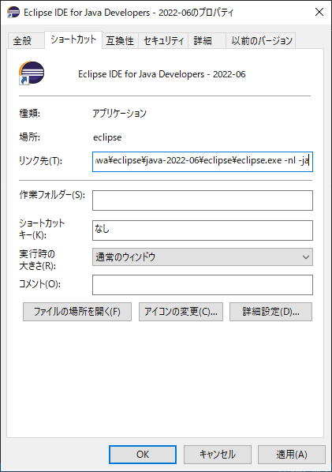
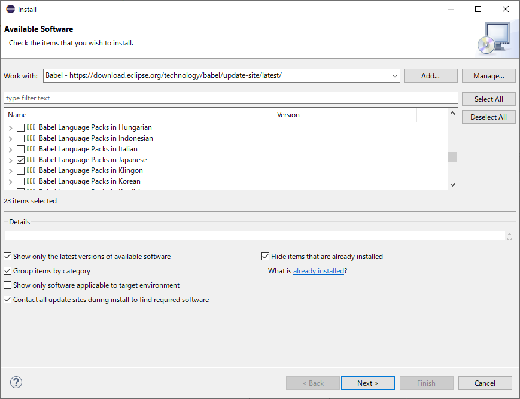
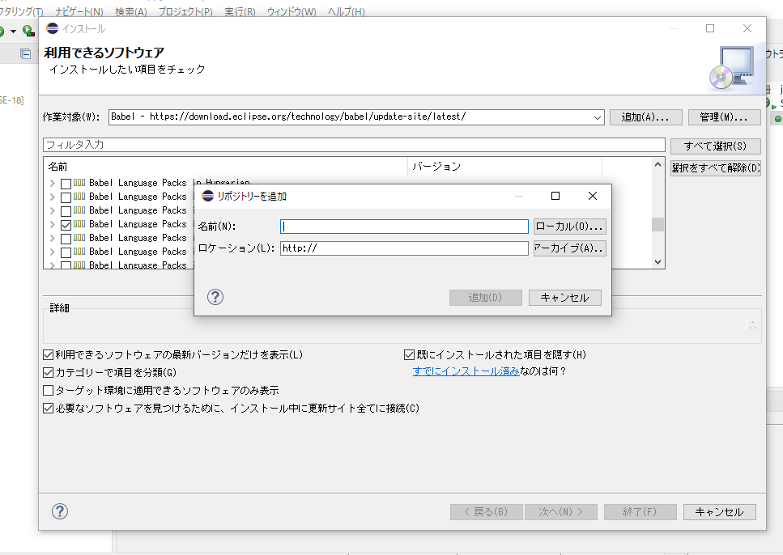
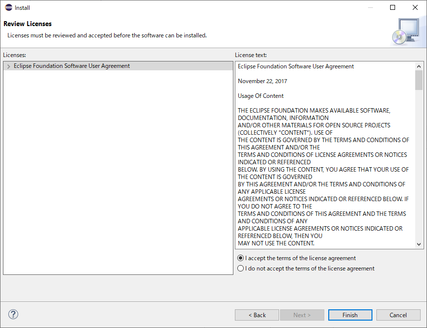

# エクリプス日本語化
## 前提
- 最低限のPC操作ができる
- 必要なものはダウンロード済

## 手順

1. とりあえずエクリプス閉じる
1. エクリプスのショートカットが存在する場所を開く
1. ショートカットを右クリックしてプロパティ
1. リンク先を編集　最後に` -nl -ja`をつける  

1. エクリプスを開く
1. 上のタブを`help > New instoler`と開く

 
1. `Work With`に`https://download.eclipse.org/technology/babel/update-site/latest/`と入力して検索、Addをクリック
1. `Japanese`を探してチェックを入れて`next`  

1. なんか出てくるけど名前は何でもいいです（わかりやすくbabelとかでいいと思います）  

 

1. `I accept~`をチェックして`Finish`  

1. エクリプス再起動

***基本的にはどんどんOKで進めれば問題ないです***

